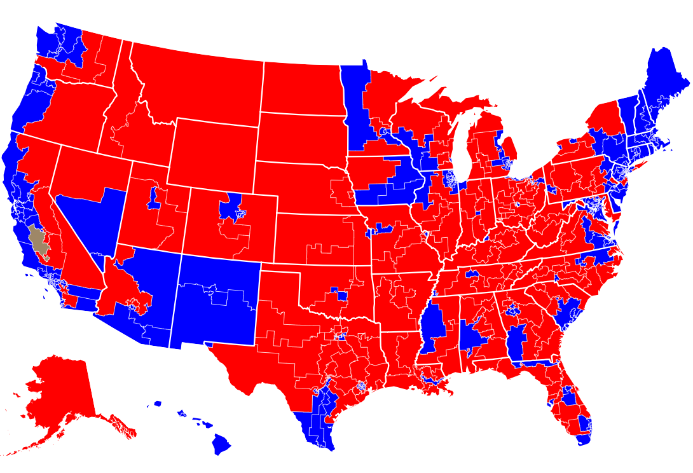

```{r setup, include=FALSE}
knitr::opts_chunk$set(echo = FALSE, fig.height = 2, fig.width = 6)
library(tidyverse)
library(here)
rcp_midterms <- read_csv(here("DATA","RCP_midterms.csv"))
rcp_midterms <- rcp_midterms %>% mutate(prop_diff = (Dem - Rep)/100, ord = 1:length(prop_diff),
                                        Dates = as.Date(Dates, "%m/%d/%Y", 
                                                        origin = as.Date("01/01/2017","%m/%d/%Y")),
                                        #tr_num_dates = trunc(as.numeric(Dates) - 17167, prec = -1)/10
                                        num_dates = as.numeric(Dates) - 17167,
                                        prob = num_dates/sum(num_dates),
                                        rel_Dem = Dem/(Dem + Rep), 
                                        rel_Rep = Rep/(Dem + Rep), 
                                        rel_diff = rel_Dem - rel_Rep,
                                        prob_full = double(length(prob)))

rcp_midterms$prob_full[rcp_midterms$SampType == "LV"] <-
  rcp_midterms$prob[rcp_midterms$SampType == "LV"] + 1/3/309

rcp_midterms$prob_full[rcp_midterms$SampType == "RV"] <-
  rcp_midterms$prob[rcp_midterms$SampType == "RV"] + 2/9/309

rcp_midterms$prob_full[rcp_midterms$SampType == "A"] <-
  rcp_midterms$prob[rcp_midterms$SampType == "A"] + 1/9/309

library(rsample)
devtools::load_all()
```


## 2018 U.S. Midterms

- Took place on Nov. 4th 2018

- Data: 309 "generic ballot" polls from Real Clear Politics

{#id .class width=250}


## Initial Bootstrapping

- Naive estimate: equal weighting of polls


```{r}
prop_diff_est <- mean(rcp_midterms$prop_diff)
ci_noweight <- with(rcp_midterms, boot_ci_propdiff(prop_diff))
```

- Estimated difference in proportions: Dem +`r round(prop_diff_est, 4)*100`%

  95% Bootstrapped CI: (`r round(ci_noweight[1],4)*100`%, `r round(ci_noweight[2],4)*100`%)

- Compare with the *current* results from The New York Times: Dem +`r 51.9-46.3`%

## Additional Techniques

- Change probability of being selected in the bootstrap

    - Higher weight for recent polls and *likely* *voters*
    
- Use "relative support" (i.e. $\frac{Dem}{Dem + Rep}$)

\pause

\vspace{.5cm}

```{r}
rcp_lv <- filter(rcp_midterms, SampType == "LV")
ci_lv <- with(rcp_lv, boot_ci_propdiff(prop_diff))
ci_weight <- with(rcp_midterms, boot_ci_propdiff(prop_diff, prob = prob))
ci_noweight <- with(rcp_midterms, boot_ci_propdiff(prop_diff))
ci_relative <- with(rcp_midterms, boot_ci_propdiff(rel_diff))

w_est <- with(rcp_midterms, weighted.mean(prop_diff, w = prob)) # weighted estimate of proportion.
rel_est <- with(rcp_midterms, mean(rel_diff))
lv_est <- with(rcp_lv, mean(prop_diff))

confints <- as.tibble(rbind(ci_noweight, ci_weight, ci_relative, ci_lv)) %>% 
  add_column(BootType = c("No Weights", "Weights", "Relative", "LikelyVoters")) %>%
  add_column(Est = c(prop_diff_est, w_est, rel_est, lv_est))


ggplot(data = confints) + 
  geom_hline(aes(yintercept = .056), linetype = "dashed", color = "blue", alpha = .5) +
  geom_pointrange(aes(x = BootType, y = Est, ymin = `2.5%`, ymax = `97.5%`)) +
  annotate("segment", x = "Relative", y = .06, xend = "Relative", yend = .0565, 
           arrow = arrow(), size=.4, alpha=.5, color = "blue") + 
  annotate("text", x = "Relative", y = 0.065, label = "True Difference", color = "blue", alpha = .5)+
  scale_y_continuous(breaks = c(.05, .056, .06, .07, .08, .09)) + 
  coord_flip() + 
  labs(y = "Estimated Prop. Diff. (Dem - Rep)", title = "Comparing estimations of 2018 U.S. Midterms")
```

## Other features of project in Github

- Regression

- Additional weighting schemes

- Streamlining bootstrapping from surveys


## 

\titlepage

[Link to my Github repo](https://github.com/ST541-Fall2018/mklapman-project-elections)
