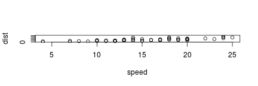

2018 U.S. Midterm Popular Vote Estimation
========================================================
author: Matt Klapman 
date: 11/27/18
autosize: false

[Link to Github repo](https://github.com/ST541-Fall2018/mklapman-project-elections)

Email: klapmanm@oregonstate.edu


First Slide
========================================================

- Took place on Nov. 4th 2018

- House of Representatives races in every district (**main focus**)

- Some Governor and Senate races


Slide With Code
========================================================


```
     speed           dist       
 Min.   : 4.0   Min.   :  2.00  
 1st Qu.:12.0   1st Qu.: 26.00  
 Median :15.0   Median : 36.00  
 Mean   :15.4   Mean   : 42.98  
 3rd Qu.:19.0   3rd Qu.: 56.00  
 Max.   :25.0   Max.   :120.00  
```

Slide With Plot
========================================================


